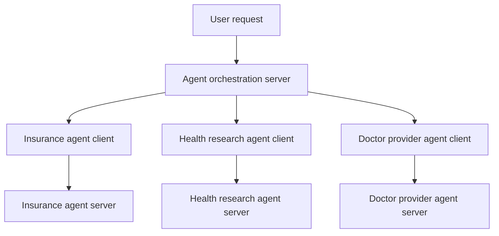

# Agent-to-Agent Learning Project

This project explores how one application can work with agents that belong to different business areas.

MCP lets an agent connect to existing tools without building every tool integration from scratch. A2A lets separate agents communicate with each other. Each agent can keep its own business logic and run on its own server.

An orchestration agent receives the user’s request and decides which agent should handle it. For this project, we will connect three agents:

| Agent | Example setup |
|---|---|
| Insurance agent | Claude on Vertex AI |
| Health research agent | Google SDK |
| Doctor provider agent | LangGraph |

These setups are examples, not a requirement to use three different frameworks or models. The agents could share the same technical structure while handling different business tasks.

The orchestration server uses an agent client to contact the right agent server. A request may go to one agent or involve several agents, depending on what the user needs. This gives us a practical way to learn how A2A works across agents with different responsibilities.