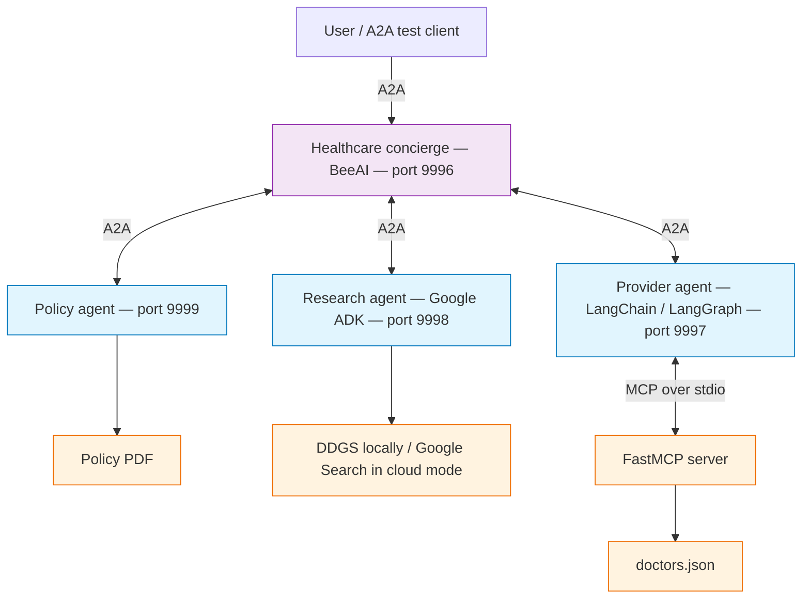

# Agent-to-Agent Learning Project

This project explores how one application can work with agents that handle different business tasks. We use a healthcare example: answering insurance questions, researching health information, and finding doctors.

MCP lets an agent connect to existing tools through a shared interface. A2A lets separate agents communicate with each other. Each agent keeps its own business logic and runs on its own server.

A healthcare concierge receives the user's request, decides which agents to contact, and brings their answers together. A request may involve one agent or several agents, depending on what the user needs.

The project supports local testing with Ollama and cloud models through the configured adapters. Using different frameworks is part of the learning exercise; agents could also use the same framework while handling different business tasks.

## Agents and model options

| Agent | Framework | Local mode | Cloud setup | Port |
| --- | --- | --- | --- | --- |
| Healthcare concierge | BeeAI `RequirementAgent` | Ollama through `OllamaChatModel` | Gemini through `VertexAIChatModel` | 9996 |
| Insurance policy agent | Custom Python agent with the A2A SDK | Ollama using text extracted from the policy PDF | Anthropic Claude with an API key; the original example used Claude on Vertex AI | 9999 |
| Health research agent | Google ADK | Ollama through `LiteLlm`, with a DDGS web search tool | Gemini on Vertex AI, with `google_search` | 9998 |
| Doctor provider agent | LangChain / LangGraph | Ollama through the LangChain adapter | The cloud model adapter configured in `ProviderAgent.py` | 9997 |

The original provider example uses `ChatOpenAI` against Vertex AI's OpenAI-compatible endpoint. A `ChatAnthropic` implementation can use an Anthropic API key instead. The provider's cloud configuration must match the adapter used in that file.

The insurance agent reads `data/2026AnthemgHIPSBC.pdf`. The provider agent connects to a FastMCP server over stdio, which reads `data/doctors.json`.

## Architecture



The concierge uses A2A clients inside its handoff tools to contact the specialist servers. The model runs inside each agent; switching between Ollama and a cloud model does not change that agent's responsibility.

## A2A concepts

| Concept | What it means |
| --- | --- |
| Discovery | An agent advertises its skills, endpoint, and supported capabilities so a client can decide when and how to use it. |
| Negotiation | The client uses the agent's advertised input/output formats and capabilities to choose a compatible interaction. Formats can include text, structured data, or files representing images, audio, and video. |
| Task and state management | Clients and agents exchange task status, progress, results, and requests for additional input while work is running. |
| Collaboration | An agent can ask for clarification or additional information, allowing the client, user, or another agent to continue the interaction. |

An **Agent Card** is a JSON metadata document describing what an agent does and how to connect to it. It is like an agent's business card: it includes its name, skills, endpoint, capabilities, and supported input/output formats.

For these servers, you can retrieve the card at:

```text
http://127.0.0.1:9996/.well-known/agent-card.json
```

A2A supports standard web technologies, including HTTP(S), JSON-RPC, gRPC, and Server-Sent Events (**SSE**). SSE carries streamed updates; it is different from server-side rendering (SSR).

Interaction patterns include direct request/response, asynchronous tasks with status polling, streaming, and push notifications through webhooks. Each server advertises which capabilities it implements. This project uses JSON-RPC over HTTP; its policy and provider examples advertise `streaming=False`. Push notifications require additional server and webhook configuration.

## Setup

Run all commands from the project root, where `main.py` and `pyproject.toml` are located.

You need Python 3.12, [uv](https://docs.astral.sh/uv/), and [Ollama](https://docs.ollama.com/quickstart) for local mode.

Install the project's Python dependencies:

```bash
uv sync
```

Dependencies are defined in `pyproject.toml`, with resolved versions recorded in `uv.lock`. A `requirements.txt` file is not needed.

The setup used in this project has BeeAI Framework `0.1.85` and A2A SDK `0.3.26`. Its server code imports `A2AStarletteApplication` from `a2a.server.apps`; keep the project's dependency constraints and lockfile when reproducing this setup. Upgrading to the A2A SDK 1.x API requires changes to that server code.

Confirm that these data files are present:

- `data/2026AnthemgHIPSBC.pdf`
- `data/doctors.json`

## Local mode with Ollama

Create a `.env` file in the project root:

```dotenv
IS_LOCAL=true
OLLAMA_MODEL=qwen2.5:7b-instruct
OLLAMA_BASE_URL=http://localhost:11434

AGENT_HOST=127.0.0.1
HEALTHCARE_AGENT_PORT=9996
PROVIDER_AGENT_PORT=9997
RESEARCH_AGENT_PORT=9998
POLICY_AGENT_PORT=9999
```

Start Ollama using its desktop application, or run the server in another terminal if it is not already running:

```bash
ollama serve
```

Download the model if needed and check the installed models:

```bash
ollama pull qwen2.5:7b-instruct
ollama list
```

The selected model needs tool-calling support for the concierge, provider, and research agents. The embedding models in `ollama list` are for embeddings and are not substitutes for the chat model.

Local mode runs model inference through Ollama. The research agent still needs internet access for DDGS web search.

`OLLAMA_BASE_URL` is used by adapters that read it. In the research server, pass it to `LiteLlm` as `api_base` and set `OLLAMA_API_BASE` from it. If an agent constructs its Ollama client with a hardcoded host, update that constructor before expecting this setting to change its endpoint.

## Cloud mode

Keep the same host and port settings, then change the model configuration in `.env`:

```dotenv
IS_LOCAL=false

# Anthropic API-key mode for the policy agent
ANTHROPIC_API_KEY=your-anthropic-api-key

# Google Vertex AI settings
GOOGLE_GENAI_USE_VERTEXAI=true
GOOGLE_CLOUD_PROJECT=your-google-cloud-project
GOOGLE_CLOUD_LOCATION=global

# Model settings read by the concierge and research server
VERTEX_MODEL=gemini-2.5-flash
RESEARCH_MODEL=gemini-3.1-pro-preview
```

Use model IDs available to your cloud project. Google authentication is handled by the project's `helpers.authenticate()` implementation; follow its credential setup. If it uses Application Default Credentials for local development, authenticate with:

```bash
gcloud auth application-default login
```

The Vertex AI branches shown in the project also use `GOOGLE_VERTEX_BASE_URL`. Set it to the endpoint expected by your `helpers.py` and adapter configuration, including any private endpoint setup. The provider's original Vertex configuration uses location `us-central1`, while the concierge and research examples use `global`.

Claude through the direct Anthropic API and Claude through Vertex AI use different clients and credentials. Select the implementation you intend to run; setting `IS_LOCAL=false` follows the cloud branch currently written in each agent.

Restart the servers after changing `.env` so the agents load the new mode and settings.

## Run all agent servers

In the first terminal:

```bash
uv run python main.py
```

The launcher starts the policy, provider, and research servers, waits for their Agent Cards, and then starts the concierge. Leave this terminal running while testing. Press **Ctrl+C** to stop the launcher and its child servers.

| Server | URL |
| --- | --- |
| Healthcare concierge | `http://127.0.0.1:9996` |
| Insurance policy | `http://127.0.0.1:9999` |
| Health research | `http://127.0.0.1:9998` |
| Doctor provider | `http://127.0.0.1:9997` |

Readiness confirms that a server responds with an Agent Card. Sending a query tests model access, tool execution, and handoffs.

To run the servers separately, use one terminal per command. Start the three specialist servers before the concierge:

```bash
PYTHONPATH=. uv run python a2aServer/policy_server.py
PYTHONPATH=. uv run python a2aServer/provider_server.py
PYTHONPATH=. uv run python a2aServer/research_server.py
PYTHONPATH=. uv run python a2aServer/orchestrator_server.py
```

Use either the launcher or the separate server commands, so two processes do not try to use the same ports.

## Test the agents

Run the individual agent scripts from the project root:

```bash
PYTHONPATH=. uv run python tests/PolicyAgent.test.py
PYTHONPATH=. uv run python tests/ProviderAgent.test.py
```

With all four servers running, test the concierge from a second terminal:

```bash
PYTHONPATH=. uv run python tests/Orchestrator.test.py
```

An example request is:

> I'm based in Austin, TX. How do I get mental health therapy near me and what does my insurance cover?

The concierge should combine policy coverage with providers returned by the provider tool, and use the research agent when health research is needed. It should identify which agent supplied each part of the answer.

For terminal scripts, print the response text. `display(Markdown(...))` is intended for a notebook and may only print a Markdown object representation in a terminal.

## Documentation

- [A2A protocol documentation](https://a2a-protocol.org/latest/)
- [A2A 0.3 specification for the SDK generation used here](https://a2a-protocol.org/v0.3.0/specification/)
- [A2A sample projects](https://github.com/a2aproject/a2a-samples)
- [BeeAI Framework A2A integration](https://i-am-bee.github.io/beeai-framework/integrations/a2a)
- [BeeAI Requirement Agent](https://i-am-bee.github.io/beeai-framework/modules/agents/requirement-agent)
- [Agent Stack introduction](https://agentstack.beeai.dev/stable/introduction/welcome)
- [uv project guide](https://docs.astral.sh/uv/guides/projects/)
- [Ollama quickstart](https://docs.ollama.com/quickstart)
