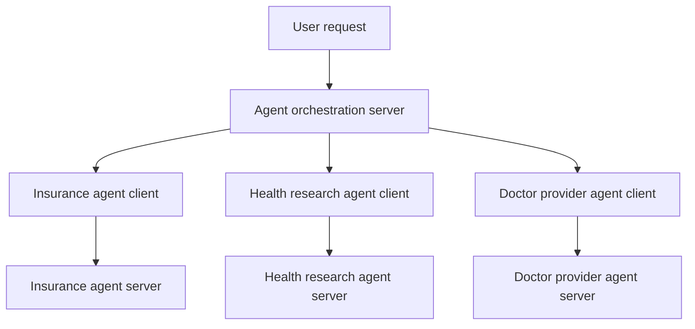
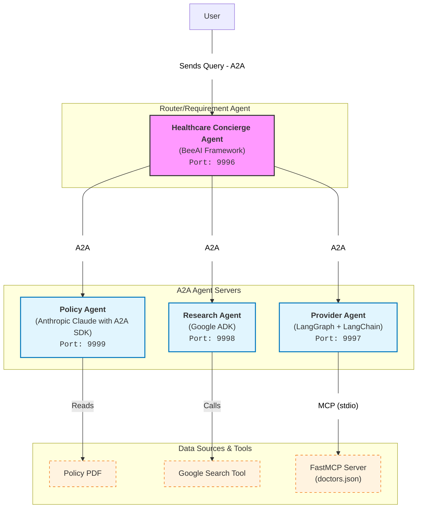

# Agent-to-Agent Learning Project

This project explores how one application can work with agents that belong to different business areas.

MCP lets an agent connect to existing tools without building every tool integration from scratch. A2A lets separate agents communicate with each other. Each agent can keep its own business logic and run on its own server.

An orchestration agent receives the user’s request and decides which agent should handle it. For this project, we will connect three agents:

| Agent | Example setup |
|---|---|
| Insurance agent | Claude on Vertex AI |
| Health research agent | Google SDK |
| Doctor provider agent | LangGraph |

These setups are examples, not a requirement to use three different frameworks or models. The agents could share the same technical structure while handling different business tasks.

The orchestration server uses an agent client to contact the right agent server. A request may go to one agent or involve several agents, depending on what the user needs. This gives us a practical way to learn how A2A works across agents with different responsibilities.

Discovery , neotiation task and stat managment collborations 
Discovery-> agent must adverions their capabililties so cient know when and hwo to utilize thema for specifu task 
neotiation->clent and agent nee to agree on communications methode like text forms , ifrome or audio/video to ensure proper user interaticon.
task and stat managment -> client and agent need  mechanisms to communicate task status , changes and dpeendeicies throughout task executions 
collborations -> client and agent must support dynamic interatio enabling agent to request cleaification , information or sub-actions from client other agent or users

Agent can communicate with standard web technologies like HTP , JSON-RPC , GRPC anf SSR 
Agent Card is json object which tell other agent what they do and how to connect  protocel
/ like passport of agent or card 

connect  with syn , asun , steam and push notifications

Doc
https://github.com/a2aproject/a2a-samples
https://agentstack.beeai.dev/stable/introduction/welcome
https://a2a-protocol.org/latest/

